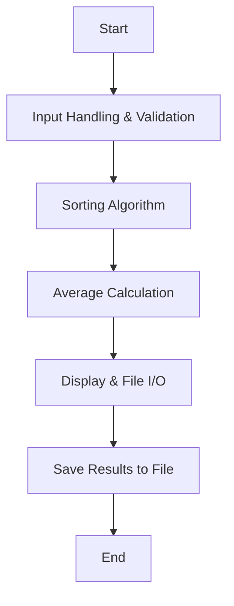

# Test Scores Analyzer

Kyle, Xander

## Test Scores Analyzer Description
This program processes student test scores using dynamic memory allocation and pointers. It sorts the scores, calculates the average after dropping the lowest score, and saves the results to a file.

### Test Scores Analyzer Flowchart

#### Function Diagrams

| `unique_ptr<int> getSize`    |               |  Xander     |
| ------------------ | ------------- | ------------ |
|    | dynamically allocates memory for array size  |              |
|    | ensures input is non-negative  | returns valid input |
***
| `unique_ptr<double[]> enterScores`    |               |  Xander     |
| ------------------ | ------------- | ------------ |
| `size:int*`    | dynamically allocates memory for test scores  |              |
|    | ensures input is non-negative  | returns valid input array|
***
| `sort_scores`    |               |  Member 2   |
| ------------------ | ------------- | ------------ |
| `scores:int*`    | sorts scores in ascending order using pointers  |              |
| `size:int`     | determines number of scores  | returns sorted list |
***
| `calculate_average`    |               |  Member 1   |
| ------------------ | ------------- | ------------ |
| `scores:int*`    | calculates the average score after dropping the lowest  |              |
| `size:int`     | determines number of scores  | returns average |
***
| `void saveData`    |               |  Xander   |
| ------------------ | ------------- | ------------ |
| `double array[]`    | saves results to file results.txt  |              |
| `int size`     |  | outputs formatted data to results.txt |
| `double average`     |   |  |
***
| `void displayData`    |               |  Xander   |
| ------------------ | ------------- | ------------ |
| `double array[]`    | displays sorted scores on screen  |              |
| `int size`     |  | outputs formatted data |
| `double average`     |  |  |
***
