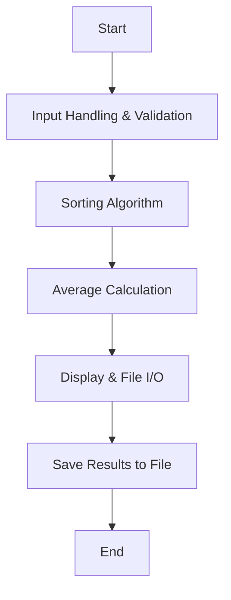

# Test Scores Analyzer
Member 1, Member 2

## Test Scores Analyzer Description
This program processes student test scores using dynamic memory allocation and pointers. It sorts the scores, calculates the average after dropping the lowest score, and saves the results to a file.

### Test Scores Analyzer Flowchart

#### Function Diagrams

| `handle_input`    |               |  Member 1     |
| ------------------ | ------------- | ------------ |
| `scores:int*`    | dynamically allocates memory for test scores  |              |
| `validate:int`     | ensures input is non-negative  | returns valid input |
***
| `sort_scores`    |               |  Member 2   |
| ------------------ | ------------- | ------------ |
| `scores:int*`    | sorts scores in ascending order using pointers  |              |
| `size:int`     | determines number of scores  | returns sorted list |
***
| `calculate_average`    |               |  Member 1   |
| ------------------ | ------------- | ------------ |
| `scores:int*`    | calculates the average score after dropping the lowest  |              |
| `size:int`     | determines number of scores  | returns average |
***
| `display_and_save`    |               |  Member 2   |
| ------------------ | ------------- | ------------ |
| `scores:int*`    | displays sorted scores on screen  |              |
| `average:float`     | saves results to file  | outputs formatted data |
***
